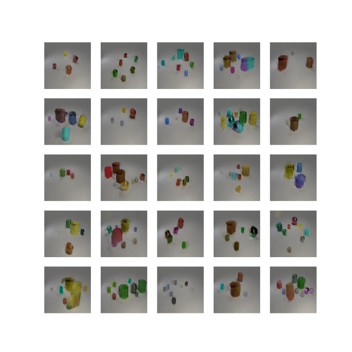

# HoloGAN

This is a modification on HoloGAN trying to reproduce BlockGAN

[HoloGAN: Unsupervised learning of 3D representations from natural images.]( https://www.monkeyoverflow.com/hologan-unsupervised-learning-of-3d-representations-from-natural-images/ ) [Thu Nguyen-Phuoc](https://monkeyoverflow.com/about/),  [Chuan Li](https://lambdalabs.com/blog/author/chuan/), Lucas Theis, [Christian Richardt]( https://richardt.name/ ) [Yong-liang Yang](http://yongliangyang.net/) 

International Conference on Computer Vision (ICCV) 2019 

# About the code

Due to the more complex design of BlockGAN I couldn't make the modifications to the TF1 code work, so tried migrating to TF2. A basic version of the HoloGAN works, WITHOUT 3D transformation (replaced by convolutions). It learns to generate images of the CLEVR dataset (example bellow), but no disentaglement at all between number of z embeddings and number of objects.

I couldn't get the version with the 3D transformations to work, because I just copied the original TF1 code and because the result is a mixed between the 2 versions I get some memory leaks on the transformation and training crushes after 4 epochs due lack of CPU/GPU RAM.

Because I've worked a lot with this code I think I have a very good understanding of it, so to try to fix my problems I'm gonna try to do a migration to Pytorch, which I'm more profficient with. It will be available on the pytorch branch.

# Images

Generated samples trained on CLEVR dataset (70.000 images) after 50 epochs. This is the model without 3D transformation that uses convolutions instead.

